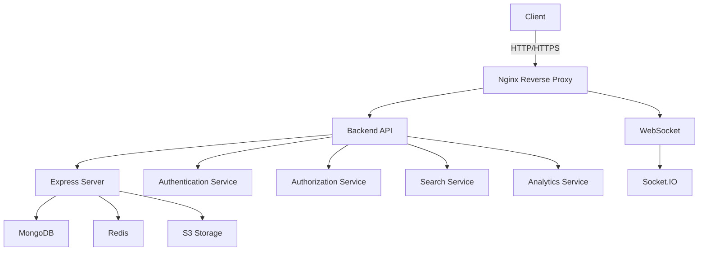
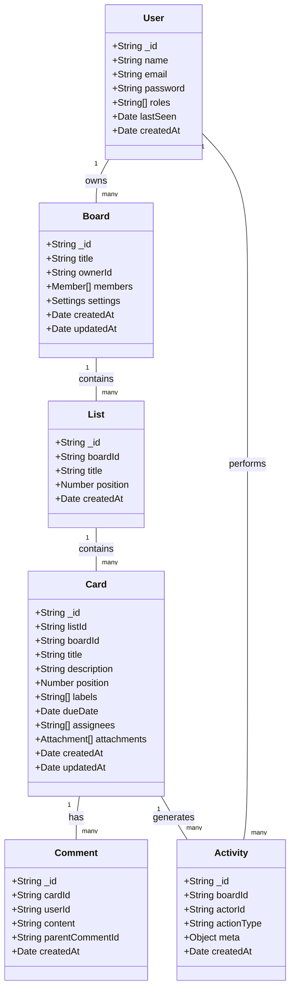
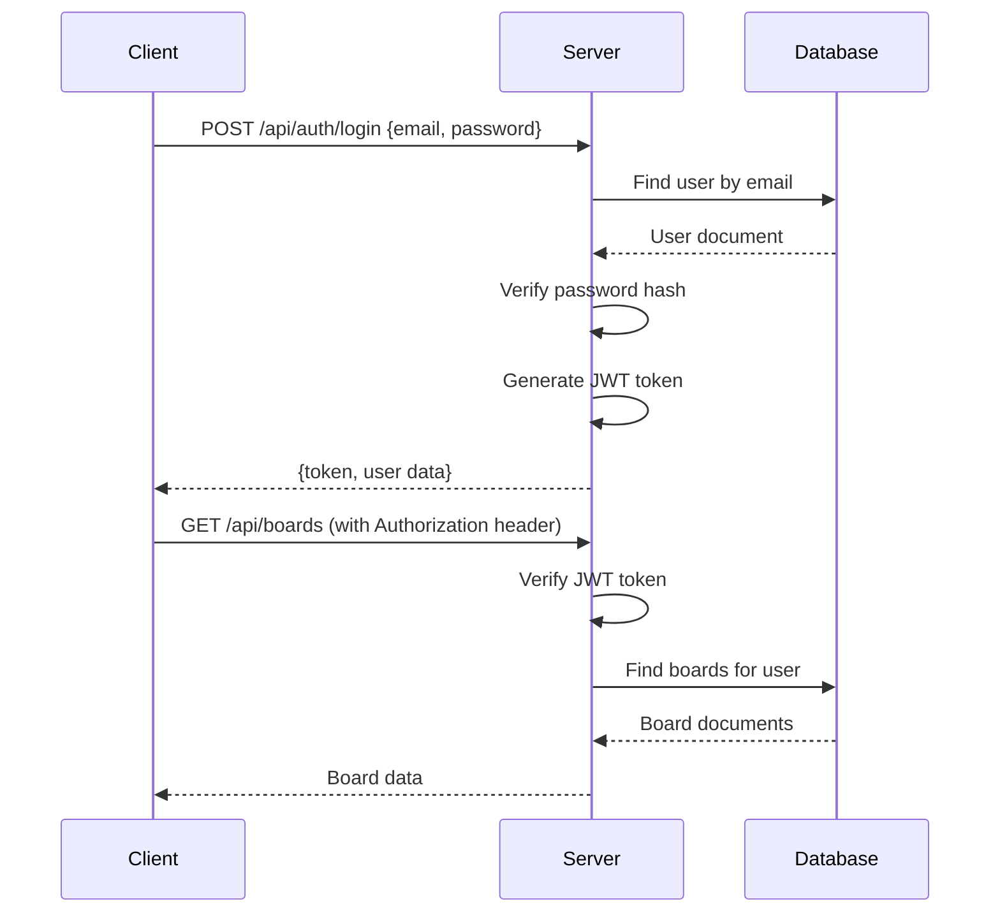
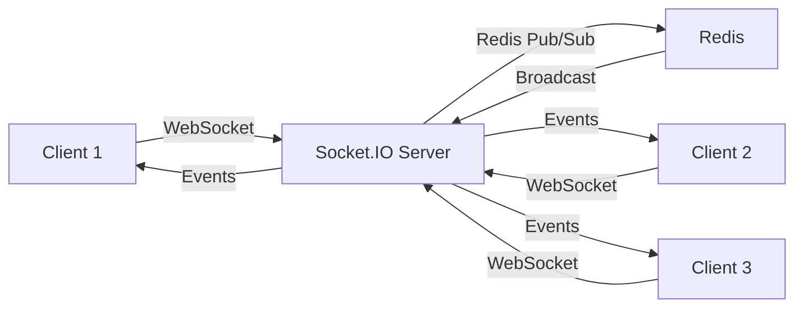

# Task Management System - Technical Specification

## System Architecture



## Component Architecture



## API Endpoints Specification

### Authentication
- `POST /api/auth/register` - User registration
- `POST /api/auth/login` - User login
- `POST /api/auth/refresh` - Token refresh
- `POST /api/auth/logout` - User logout
- `GET /api/auth/me` - Get current user

### Boards
- `GET /api/boards` - Get all user boards
- `POST /api/boards` - Create new board
- `GET /api/boards/:id` - Get board details
- `PUT /api/boards/:id` - Update board
- `DELETE /api/boards/:id` - Delete board
- `POST /api/boards/:id/members` - Add member to board
- `DELETE /api/boards/:id/members/:userId` - Remove member from board

### Lists
- `GET /api/boards/:boardId/lists` - Get all lists in board
- `POST /api/boards/:boardId/lists` - Create new list
- `PUT /api/lists/:id` - Update list
- `DELETE /api/lists/:id` - Delete list
- `PUT /api/lists/reorder` - Reorder lists

### Cards
- `GET /api/lists/:listId/cards` - Get all cards in list
- `POST /api/lists/:listId/cards` - Create new card
- `PUT /api/cards/:id` - Update card
- `DELETE /api/cards/:id` - Delete card
- `PUT /api/cards/:id/move` - Move card between lists
- `POST /api/cards/:id/attachments` - Add attachment
- `DELETE /api/cards/:id/attachments/:attachmentId` - Remove attachment

### Comments
- `GET /api/cards/:cardId/comments` - Get all comments
- `POST /api/cards/:cardId/comments` - Add comment
- `PUT /api/comments/:id` - Update comment
- `DELETE /api/comments/:id` - Delete comment

### Search
- `GET /api/search?q=query` - Search boards and cards

### Analytics
- `GET /api/analytics/:boardId` - Get board analytics
- `GET /api/analytics/users/:userId` - Get user analytics

### Users
- `GET /api/users` - Get all users (admin only)
- `GET /api/users/:id` - Get user details
- `PUT /api/users/:id` - Update user
- `DELETE /api/users/:id` - Delete user

## WebSocket Events

### Connection Management
- `join_board` - Join a board room
- `leave_board` - Leave a board room

### Card Events
- `card_created` - New card created
- `card_updated` - Card updated
- `card_moved` - Card moved between lists
- `card_deleted` - Card deleted

### Comment Events
- `comment_added` - New comment added
- `comment_updated` - Comment updated
- `comment_deleted` - Comment deleted

### Presence Events
- `presence_update` - User presence status update
- `typing` - User typing indicator
- `cursor_position` - User cursor position

## Database Schema

### Collections

#### Users
```json
{
  "_id": "ObjectId",
  "name": "String",
  "email": "String",
  "password": "String",
  "roles": ["String"],
  "avatarUrl": "String",
  "lastSeen": "Date",
  "createdAt": "Date",
  "updatedAt": "Date"
}
```

#### Boards
```json
{
  "_id": "ObjectId",
  "title": "String",
  "ownerId": "ObjectId",
  "members": [
    {
      "userId": "ObjectId",
      "role": "String"
    }
  ],
  "settings": {
    "backgroundColor": "String",
    "isPrivate": "Boolean"
  },
  "createdAt": "Date",
  "updatedAt": "Date"
}
```

#### Lists
```json
{
  "_id": "ObjectId",
  "boardId": "ObjectId",
  "title": "String",
  "position": "Number",
  "createdAt": "Date"
}
```

#### Cards
```json
{
  "_id": "ObjectId",
  "listId": "ObjectId",
  "boardId": "ObjectId",
  "title": "String",
  "description": "String",
  "position": "Number",
  "labels": ["ObjectId"],
  "dueDate": "Date",
  "assignees": ["ObjectId"],
  "attachments": [
    {
      "url": "String",
      "key": "String",
      "name": "String",
      "size": "Number",
      "type": "String"
    }
  ],
  "createdAt": "Date",
  "updatedAt": "Date"
}
```

## Authentication Flow



## Real-time Architecture



## Implementation Details

### Authentication System
- JWT with refresh tokens
- Password hashing with bcrypt
- Role-based access control
- Session management with Redis

### Real-time System
- Socket.IO with Redis adapter for scaling
- Room-based communication (per board)
- Presence tracking
- Typing indicators
- Conflict resolution for concurrent edits

### File Storage
- S3-compatible storage
- File validation and size limits
- Proper error handling
- File metadata storage in MongoDB

### Search System
- MongoDB text indexes
- Full-text search for boards and cards
- Filtering capabilities
- Pagination support

### Offline Support
- Local queue for offline operations
- Sync mechanism when online
- Conflict resolution UI
- Optimistic UI updates

## Technical Requirements

### Backend
- Node.js 18+
- Express 4.x
- MongoDB 6.x
- Redis 7.x
- Socket.IO 4.x
- JWT for authentication
- Multer for file uploads
- AWS SDK for S3

### Frontend
- React 18+
- TypeScript 5.x
- Zustand for state management
- React Router 6.x
- Socket.IO Client 4.x
- Axios for HTTP requests
- Tailwind CSS for styling

### Infrastructure
- Docker for containerization
- Nginx for reverse proxy
- GitHub Actions for CI/CD
- DigitalOcean/AWS for hosting
- Sentry for error monitoring

## Performance Considerations

- Implement proper caching
- Add rate limiting
- Implement proper error handling
- Add comprehensive logging
- Implement health checks
- Add proper monitoring

## Security Considerations

- Input validation
- Proper authentication
- Role-based authorization
- Rate limiting
- CORS configuration
- Helmet for security headers
- CSRF protection
- Proper error handling without exposing sensitive information